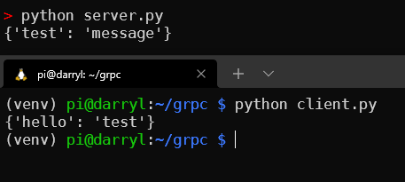

# RPi-Zero

> 50.012 Networks Project

## Set up Raspberry PI

1. Install [Raspberry Pi OS lite]((https://www.raspberrypi.com/documentation/computers/getting-started.html)) in RPi.
2. With the SD card connected, run the [RPi Imager](https://www.raspberrypi.com/software/).
3. Press `ctrl + shift + x` to open settings and fill in the options for wifi, ssh and password.
4. Transfer the SD card to RPi and connect the RPi to a power source.
5. Boot into the Raspberry Pi using SSH. Can either use `raspberrypi` or `raspberrypi.local` or look at your router entry to determine IP address of the RPi. Tutorials: [VSC](https://www.raspberrypi.com/news/coding-on-raspberry-pi-remotely-with-visual-studio-code/)
6. Install PIP

    ```bash
    sudo apt-get instal python3-pip
    ```

7. Install GIT

    ```bash
    sudo apt-get install git
    ```

## Installation

``` bash
https://github.com/LoJunKai/RPi-Zero.git
pip3 install -r requirements.txt
```

## gRPC

After installing all the requirements (I recommend creating virtual environment using venv), you can start using the gRPC packages.

1. cd into the project folder with the '.proto' file. You need to generate the library from the proto file using:

    ```bash
    python -m grpc_tools.protoc -I. --python_out=. --grpc_python_out=. ./example.proto
    ```

2. After the code is generated, you can run:

    ```bash
    python client.py --name client --times 10
    ```

3. Do the same for the server (your computer) then run:

    ```bash
    python server.py --name server
    ```

You will get the below output from the server and client commad line:  
  
At this point, you might need to connect to the host server (your computer), thus you need to bind the ports remote from the raspberry pi to the server by using:

```bash
ssh -R 50051:localhost:50051 pi@darryl.local
```

This connects the port from the raspberry pi to the port in the server, to allow data transfer.  
**NOTE**: if you are having trouble compiling the proto file, please look at the debugging section for common bugs and how to overcome them.

## Debugging

1. When compiling the proto file, you occur 'cannot import libatomic.so.1', follow this [source](https://github.com/EdjeElectronics/TensorFlow-Object-Detection-on-the-Raspberry-Pi/issues/67):


## MQTT

### Setup

1. Run the mosquitto broker on your laptop (follow instructions in `broker_setup.sh`).
2. Update the `MQTT_BROKER_IP` with the local IP address of your broker.

### Running

> Still a work in progress

1. Run `sub_setup.sh` on the RPi first.
2. Run `pub_setup.sh` on the Laptop next.

## Graph Plotting

for python script found at:
`./grpc/plot_metrics.py`

### Setup

need these packages
```
pip install pandas
pip install matplotlib
```

edit filename (.csv) 
```
log_filename = "mqtt_1000.csv"`
```
### Running

```
python plot_metrics.py
```

#### Note

functions:

`reformat_log_csv(log_fp) `
>-creates a temporary file:  `./grpc/temp.csv`
>-only need to run 1x 
>(once reformat function called > overwrites csv previous content)


`plotAllMetricsGraph(log_fp)`
`plotCpuGraph(log_fp)`
`plotMemGraph(log_fp)`
`plotNetworkIn(log_fp)` (can remove outliers to visualise plots better)
`plotNetworkOut(log_fp)`
