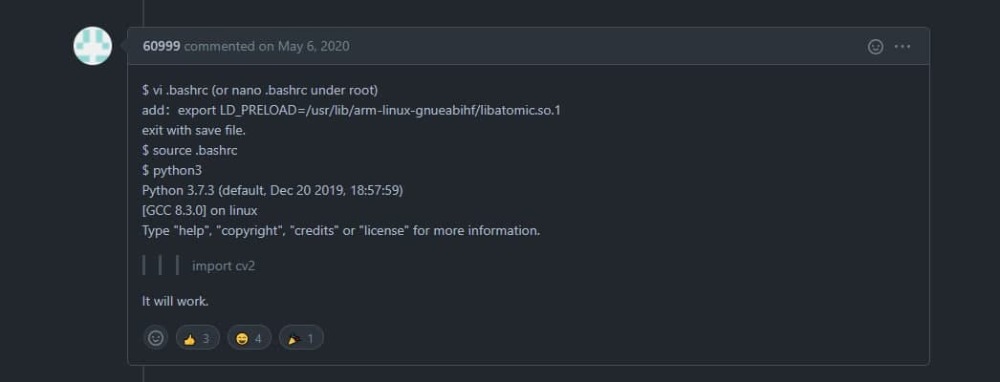

# RPi-Zero
50.012 Networks Project
## Set up Raspberry PI
1. Install [Raspberry Pi OS lite]((https://www.raspberrypi.com/documentation/computers/getting-started.html)) in rapsberry, then boot into the Raspberry Pi using SSH
2. Install PIP 
```bash
sudo apt-get instal python3-pip
```
3. Install GIT
```bash
sudo apt-get install git
```
4. Git clone the project and then install all the requirements
```bash
pip3 install -r requirements.txt
```
## gRPC
After installing all the requirements (I recommend creating virtual environment using venv), you can start using the gRPC packages.  
1. cd into the project folder with the '.proto' file. You need to generate the library from the proto file using:
```bash
python -m grpc_tools.protoc -I. --python_out=. --grpc_python_out=. ./example.proto
```
2. After the code is generated, you can run:
```bash
python client.py
```
3. Do the same for the server (your computer) then run:
```bash
python server.py
```
You will get the below output from the server and client commad line:  
  
At this point, you might need to connect to the host server (your computer), thus you need to bind the ports remote from the raspberry pi to the server by using: 
```bash
ssh -R 50051:localhost:50051 pi@darryl.local
```
This connects the port from the raspberry pi to the port in the server, to allow data transfer.  
**NOTE**: if you are having trouble compiling the proto file, please look at the debugging section for common bugs and how to overcome them.
## Debugging
1. When compiling the proto file, you occur 'cannot import libatomic.so.1', follow this [source](https://github.com/EdjeElectronics/TensorFlow-Object-Detection-on-the-Raspberry-Pi/issues/67):

