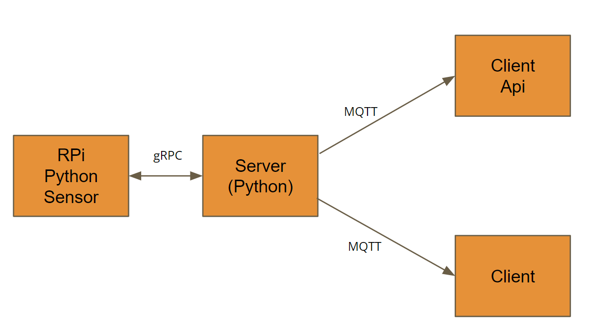
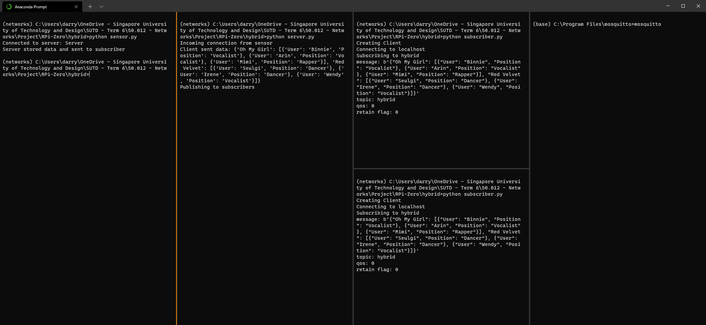

# Hybrid Model

The hybrid model uses both gRPC and MQTT. 
* gRPC is mainly used for communication between the IoT device and the server.
* MQTT is mainly used for the server to public data to the subscribers.

This hybrid model is great for IoT applications. You can take a look at the below model:


The code in this folder follows the template. You can follow the guide below to set up the project!

# Guide
## Files
* 'sensor.py' runs on the RPi
* 'server.py' runs on the Server
* 'subscriber.py' runs on any devices that you want the updates to be received
* 'hybrid.proto' protobuf for 'sensor.py' and 'server.py'
* 'cMsg.json' sample file for json data

**NOTE:** You can run everything in your computer if you want to test out its functionality first.

# Get it up and running
1. Compile the grpc proto file for python:
```bash
python -m grpc_tools.protoc -I./ --python_out=. --grpc_python_out=. ./hybrid.proto
```
2. Start the mosquitto broker in your server. Open another Terminal and go to the folder with the downloaded binaries for mosquitto (for windows, it's C:\Program Files\mosquitto) and run the following command: 
```bash
mosquitto
```
3. Start the server script in another terminal:
```bash
python server.py
```
4. Start subscribers in another terminal, you can start as many as you want:
```bash
python subscriber.py
```
5. Finally, we can send updates from the RPi to the server and the server will automatically publish to all the subscriber:
```bash
python sensor.py
```
The end result should look like this:

Congratualations, you have deployed the Hybrid Model pipeline.  
The model is easily scalable to handle more sensors and more subscribers, you can do many things with it!
