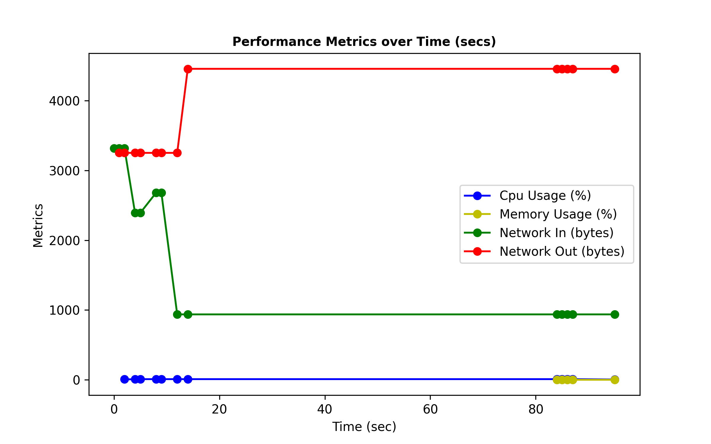
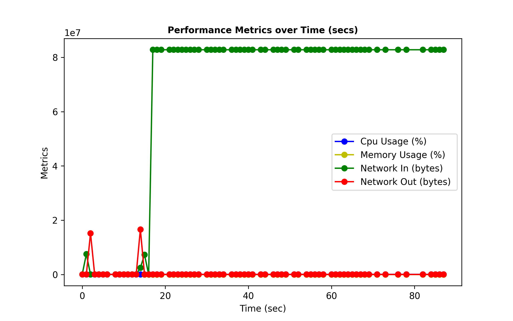
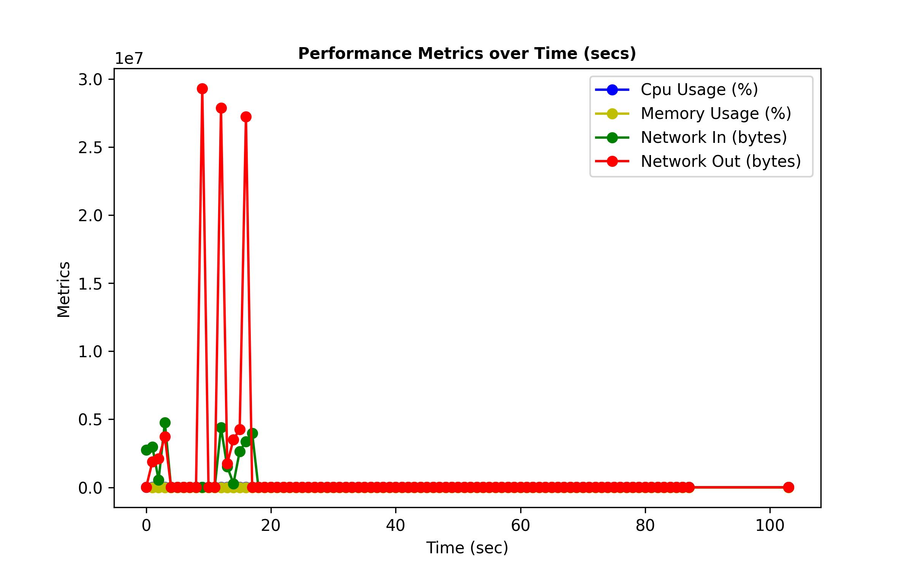
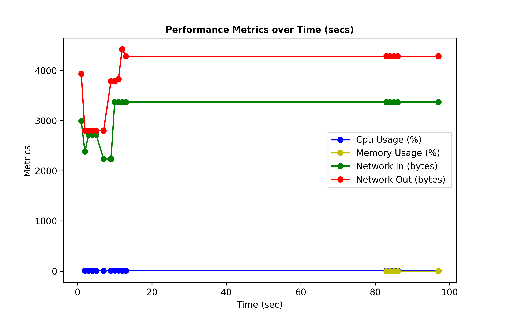
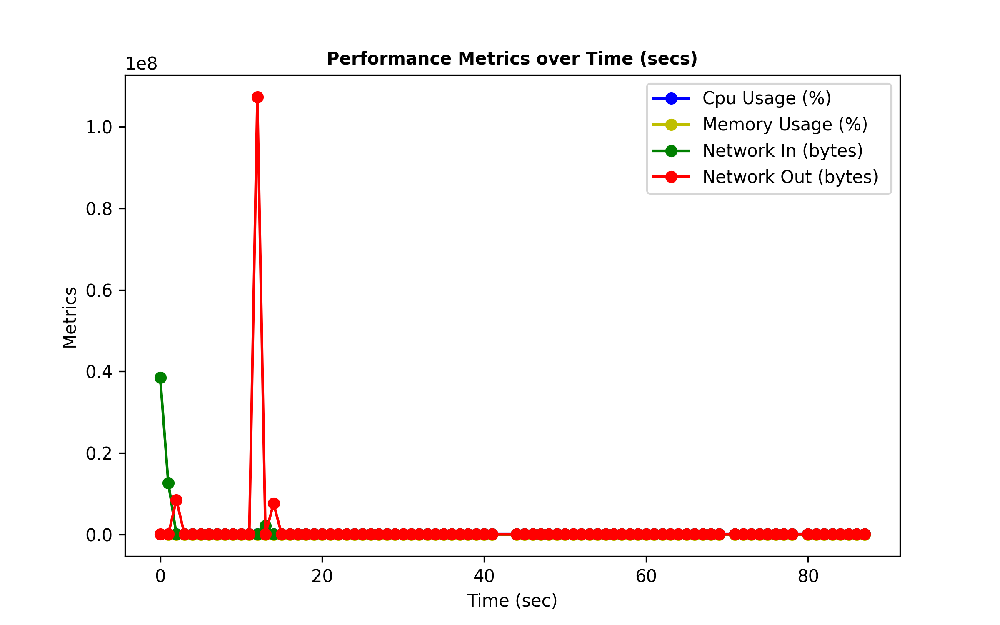
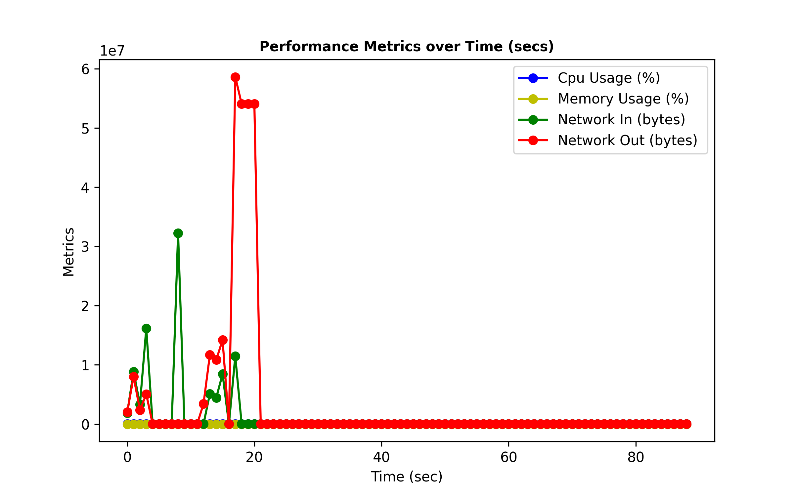

# Testing
This folder is used for measuring the performance of MQTT and gRPC. You can tune the number of files that are sent in the client/publisher run commands, '--times'.

For our test we ran with a simple JSOn file of 558 bytes for 100, 1000, 10000 times.

For the full results, pleas follow this [link](https://drive.google.com/drive/folders/1MuwJo2DjKXCEa0BCpPB7SQcP2kZnXVBb?usp=sharing)

# Results
## gRPC 100

## gRPC 1000

## gRPC 10000

## MQTT 100

## MQTT 1000

## MQTT 10000
